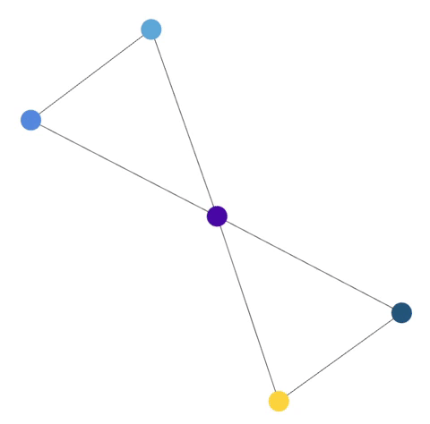
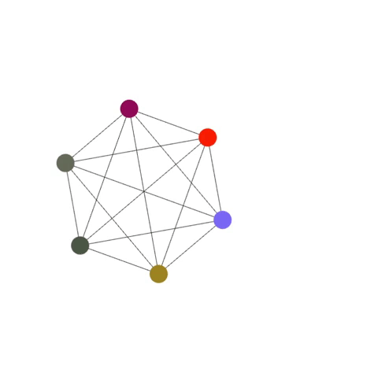
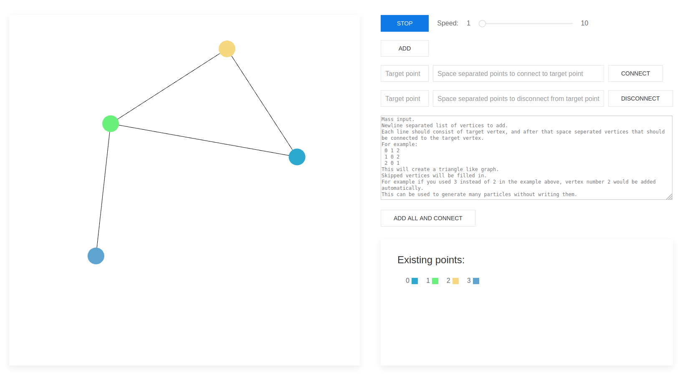

# Force directed graph drawing

Implementation of graph drawing using force directed algorithm, specifically the Fruchterman-Reingold variant.

## Examples

In GIFs below the algorithm was purposefully slowed down so the changes can be displayed.

Responding to addition of vertices and connections:



Untagling of a trivial structure:


Responding to deletion of connections:



## Details

The algorithm was written in C++ and then compiled into WebAssembly using emsdk so that it can be used in JavaScript. The graph was displayed using WEBGL (3.0 es) in a canvas on a website. The website has several graph manipulation functionalities (add, connect, disconnect, etc.) and a slider for controlling algorithm speed.



## Building

Requirements:
* [emsdk](https://emscripten.org/docs/getting_started/downloads.html)

To build the project and output the required wasm binary in the correct folder, run the following command in the root folder:

```
$ em++ WASM=1 graph.cpp -std=c++17 -g --bind -s -o out/main.js
```

There is also a VSCode task in the repository that can be used to build. Keep in mind that emsdk binaries need to be in the path (see link above on how to do that).

## Running

To run the website, run any http server and set `out` as the root folder for static content. After that just connect to `localhost:8080/main.html` or some other port you have defined.

Example that uses the [darkhttpd](https://unix4lyfe.org/darkhttpd/) tiny webserver (from root folder of project):

```
$ darkhttpd out
```